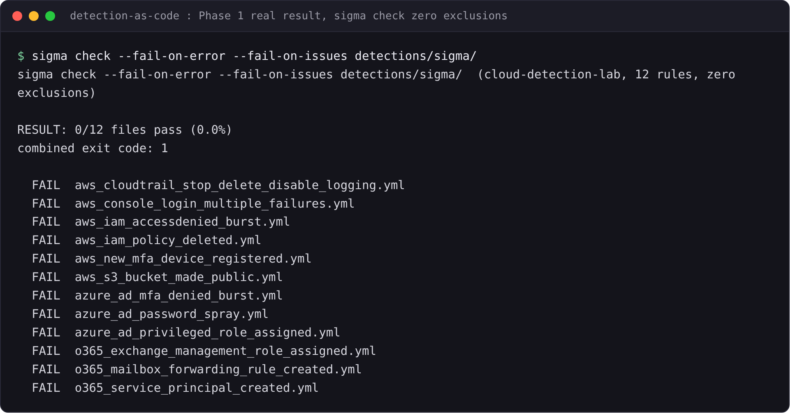
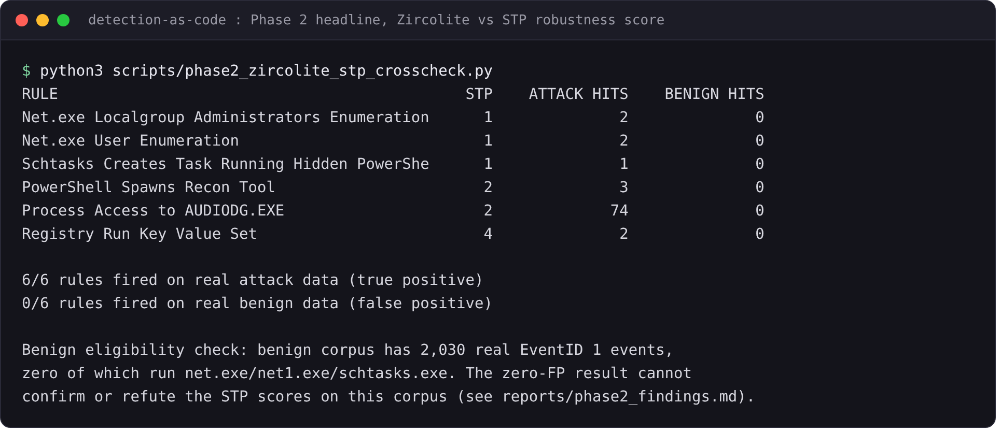
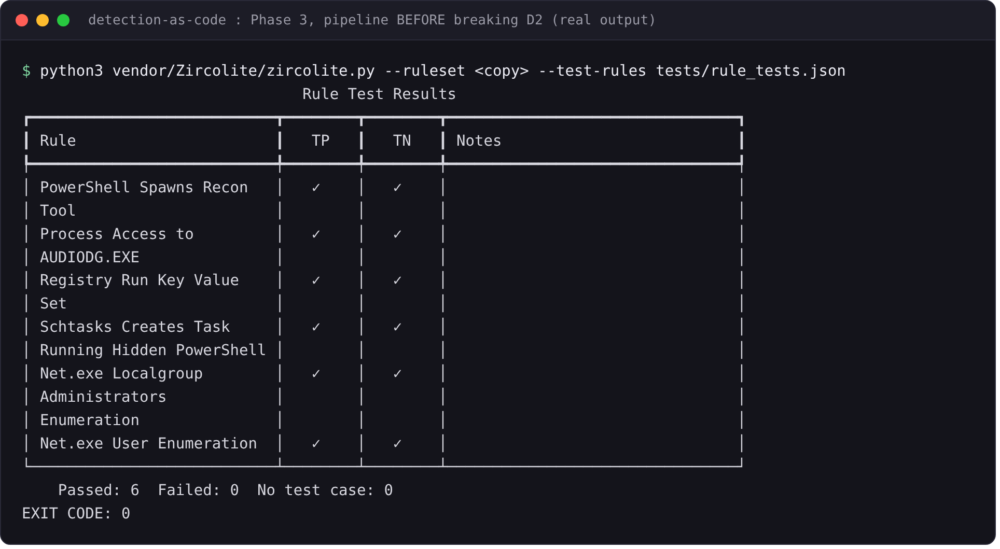
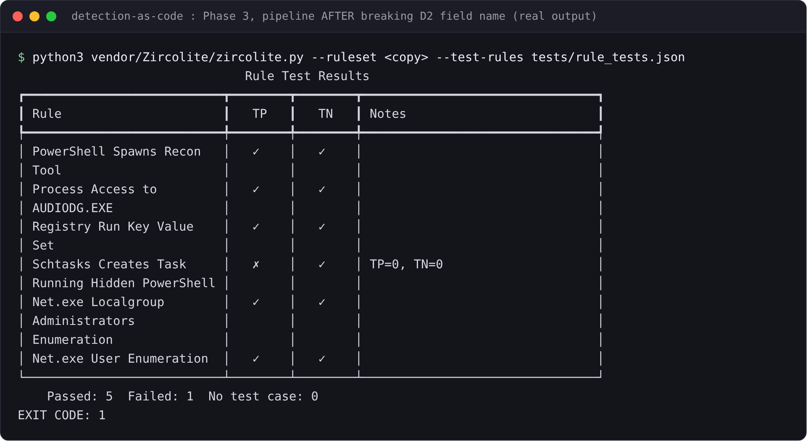
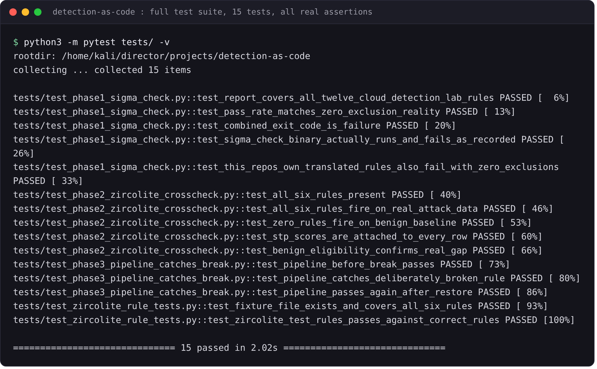

# detection-as-code

Does an independent tool agree with the robustness scores a detection portfolio
already published about its own detections? This project runs the check and
reports the real result, whichever way it comes out.

## Terms, defined once, up front

- **Detection.** A saved search or rule that flags a specific pattern of
  activity in security log data (for example: "a process named `net.exe` ran
  with the argument `localgroup`").
- **Sigma.** An open, YAML-based format for writing detections in a way that
  is not tied to any one product. A Sigma rule can be converted into the
  native query language of many different tools (Splunk's SPL, Elastic's
  query language, and others).
- **SPL.** Splunk's own search query language. Splunk detections are
  typically written directly in SPL rather than in Sigma.
- **CI (continuous integration).** Automatically running checks (tests,
  linters, validators) every time code changes, usually before it is allowed
  to merge. In this project, "CI" means running checks against detection
  rules the same way a software team runs checks against application code.
- **Validator / linter.** A tool that reads a rule and checks it for
  structural or stylistic problems, for example a missing required field or
  a malformed tag. A validator does not run the rule against any data; it
  only reads the rule text.
- **Behavioural testing.** Actually running a detection against real log
  data and checking whether it fires when it should (on an attack) and stays
  quiet when it should (on ordinary activity). This is a stronger, different
  kind of check than a validator: a rule can pass every validator and still
  never fire on the behaviour it claims to detect, or fire on everything.
- **True positive / true negative.** In this context, an event that SHOULD
  trigger a detection (true positive) and an event that should NOT (true
  negative). A behavioural test feeds both kinds of events to a rule and
  checks it reacts correctly to each.
- **Robustness (STP score).** MITRE's Center for Threat-Informed Defense
  publishes a framework called Summiting the Pyramid (STP) that scores how
  easily a detection can be evaded by an adversary who changes small details
  of their attack without changing the underlying technique. A low score
  means the rule matches something trivial to change (an exact command-line
  string); a high score means the rule matches something the technique
  cannot avoid.

## The question this project answers

Two sibling projects on this machine already publish detections and already
score some of them for robustness by hand:

- **cloud-detection-lab** has 12 Sigma rules for AWS/Azure/O365 activity.
- **splunk-detection-lab** has 6 hand-written SPL detections and a published
  MITRE STP robustness score for each, reasoned from the rule's logic:
  D1 scores 4 (hard to evade), D2/D3/D4 score 1 (the lowest tier, literal
  command-line text), D5/D6 score 2.

This project asks: if an independent tool actually runs these detections
against real captured data, does it agree with those published scores? A
validator that only checks YAML structure and a pytest suite that only
checks the rules parse correctly would prove nothing about that question;
both already exist in the sibling projects and neither runs the detections
against data. This project adds the layer that does: real semantic
validation with zero exclusions, and a real behavioural replay against real
attack and benign log data.

## What was built, in three phases

### Phase 1: the strict validator

Runs SigmaHQ's own real validator, `sigma check --fail-on-error
--fail-on-issues`, using the `pySigma-validators-sigmahq` plugin, against
cloud-detection-lab's 12 Sigma rules, with **zero exclusions**. SigmaHQ's own
production configuration for this exact command excludes a long list of
validators and specific rule IDs even against its own 3,000+ rule corpus.
Running it here with no exclusions against 12 hand-written rules is a fair
strictness test precisely because the rules get no help.

### Phase 2: the behavioural cross-check (the headline)

Uses **Zircolite**, a tool that compiles Sigma rules to SQL and runs them
against events loaded into SQLite, to actually execute detections against
real data:

- 6 Sigma-equivalent rules were written in this repo
  (`sigma_rules/splunk_detection_lab/`), each a field-for-field translation
  of one of splunk-detection-lab's real SPL detections (not a rewrite; see
  each rule file's own description for the exact SPL it mirrors).
- Those rules were run against splunk-detection-lab's real converted attack
  captures (`data/converted/attack/`, 50,859 events) and real converted
  benign baseline (`data/converted/benign/`, 242,133 events from one Windows
  Server 2022 host).
- The result is compared, rule by rule, against the published STP robustness
  score for that detection.

### Phase 3: prove the pipeline catches a real defect

A copy of one rule (D2) has its `CommandLine` field renamed to a field that
does not exist in the data, the pipeline is run and shown to fail, the rule
is restored, and the pipeline is shown to pass again. This is proven twice:
once as a saved transcript
(`reports/phase3_before_broken.txt`, `reports/phase3_after_broken.txt`,
`reports/phase3_restored.txt`) and once as a live, re-runnable pytest test
(`tests/test_phase3_pipeline_catches_break.py`) that performs the same break
and restore itself on every run.

cloud-detection-lab, splunk-detection-lab, and detection-rule-lab are
**read-only inputs** to this project. Nothing in them was modified.

## Phase 1 result

**0 of 12 cloud-detection-lab Sigma rules pass `sigma check
--fail-on-error --fail-on-issues` with zero exclusions. Pass rate: 0.0%.
Command exit code: 1 (fail).**



What actually failed, and why, by validator class (38 total issues across
the 12 files, see `reports/phase1_sigma_check.json` for the full per-rule
detail):

| Issue | Count | What it means |
|---|---|---|
| `SigmahqMitreLinkIssue` | 12 | Rule cites a MITRE ATT&CK URL in `references:` instead of the required `attack.tNNNN` tag. Every one of the 12 rules has this. |
| `SigmahqAuthorExistenceIssue` | 4 | Rule has no `author:` field. |
| `SigmahqDateExistenceIssue` | 4 | Rule has no `date:` field. |
| `SigmahqDescriptionExistenceIssue` | 4 | Rule has no `description:` field. |
| `SigmahqCorrelationFilenamePrefixIssue` | 4 | The 4 correlation rules (threshold detections like "5 failed logins in 10 minutes") do not follow SigmaHQ's filename convention of a `correlation_` prefix. |
| `SigmahqTagsTechniquesWithoutTacticsIssue` | 3 | Rule tags a specific ATT&CK technique (e.g. `attack.t1556.006`) but not the parent tactic (e.g. `attack.credential-access`) SigmaHQ requires alongside it. |
| `SigmahqLogsourceUnknownIssue` | 3 | **The most substantive finding.** All 3 O365 rules (`o365_exchange_management_role_assigned`, `o365_mailbox_forwarding_rule_created`, `o365_service_principal_created`) use a `logsource:` combination (`product: o365, service: exchange` or `service: azuread`) that the SigmaHQ validator does not recognise as a defined logsource at all. This is a real semantic gap, not a style nitpick: it means these 3 rules use a logsource shape outside what SigmaHQ's own taxonomy defines. |
| `NumberAsStringIssue` | 2 | A numeric value (an error code) was written as a quoted string instead of a bare number. |
| `InvalidATTACKTagIssue` | 2 | A tag does not match SigmaHQ's list of valid ATT&CK tactic/technique tag strings. |

No rule failed to **parse** (0 parsing errors). Every failure is a semantic
or metadata-hygiene issue the strict validator profile catches; none is a
syntax error. That distinction matters: these rules would still convert and
run, but a CI gate configured the way SigmaHQ configures its own would
reject all 12 of them today.

This repo's own 6 Sigma-equivalent rules (written for Phase 2, translated
directly from splunk-detection-lab's SPL) were checked the same way and
**also fail with zero exclusions, 0/6** (`reports/phase1_repo_rules_sigma_check.json`).
This confirms the strict profile is genuinely strict across two independently
written rulesets, not an artifact of one project's style.

## Phase 2 result, the headline

**All 6 of 6 rules fired on real attack data. 0 of 6 rules fired on the real
benign baseline, at every STP score level from 1 to 4.**



| Detection | STP score | Attack hits | Benign hits |
|---|---|---|---|
| D2 Schtasks hidden PowerShell | 1 (weakest) | 1 | 0 |
| D3 Net localgroup admins | 1 | 2 | 0 |
| D4 Net user enumeration | 1 | 2 | 0 |
| D5 Process access AUDIODG | 2 | 74 | 0 |
| D6 PowerShell spawns recon tool | 2 | 3 | 0 |
| D1 Registry Run key SetValue | 4 (strongest) | 2 | 0 |

**The two measures agree that every rule works, and disagree about nothing,
because the comparison this data can support is narrower than it first
looks.** All 6 detections correctly fire on their own real attack behaviour,
which independently confirms the translated Sigma logic is correct end to
end. But the benign-side comparison, the part that would actually test
whether the STP-weak rules (D2/D3/D4, scored 1: literal command-line text
with no inherent link to the technique) behave worse than the STP-strong
rule (D1, scored 4), produced **zero false positives across the board**,
regardless of score.

That is not a robustness confirmation. A direct check
(`reports/phase2_benign_eligibility.json`, computed by
`scripts/phase2_benign_eligibility_check.py`) shows why: the benign corpus
(one Windows Server 2022 host, one capture window) has 2,030 real process-creation
events, 6,194 real process-access events, and 66,675 real registry
SetValue events, the right event TYPES for every rule to be tested against.
But **zero** of those events run `net.exe`, `net1.exe`, or `schtasks.exe`
(what D2/D3/D4/D6 key on), touch `AUDIODG.EXE` (what D5 keys on), or write
a registry value under a `Run` key (what D1 keys on). The STP-weak rules
never had a real chance to produce a false positive on this specific corpus,
so their silence here cannot be read as evidence they are robust. This
distinction, and why it is not a false equivalence, is written up in full in
[`reports/phase2_findings.md`](reports/phase2_findings.md).

**What would actually test the STP hypothesis:** a benign corpus containing
ordinary, non-attacker use of `net.exe`, `schtasks.exe`, and PowerShell (a
fleet of real admin workstations, not one server host). That data does not
exist locally in this portfolio.

**cloud-detection-lab has no local, offline dataset**, so this behavioural
layer does not extend to it. Its Phase 1 data lives only in a live local
Splunk index, not as files in the repo; there is nothing for Zircolite to
replay against without exporting that index or standing up Splunk, which is
out of scope here. Phase 1 (the strict validator) is the only layer this
project can run against cloud-detection-lab.

## Phase 3 result

**Before:** the pipeline run against a correct copy of the 6 rules passes,
`Passed: 6 Failed: 0`, exit code 0.



**The break:** D2's `CommandLine|contains|all:` field was renamed to
`CommandlineArgs|contains|all:`, a field that does not exist anywhere in the
real event data. This is a realistic defect class: syntactically valid YAML,
a syntactically valid Sigma field reference, just the wrong field name for
this data source.

**After:** the same pipeline, same fixture, run against the broken copy:



`D2` flips from `TP ✓` to `TP ✗`, `Passed: 5 Failed: 1`, exit code 1. The
rule was restored and the pipeline passed again (`reports/phase3_restored.txt`).
The full break/restore cycle is also automated and re-runs on every test
invocation in `tests/test_phase3_pipeline_catches_break.py`, which performs
the break and restore itself inside a temp directory rather than replaying a
saved transcript.

## Tests

All 15 tests use real assertions against real recorded output or real live
subprocess runs. Every test's ability to fail was proven directly:



| Test file | What it proves | How its ability to fail was proven |
|---|---|---|
| `test_phase1_sigma_check.py` | The Phase 1 pass rate (0/12), the exit code, and that this repo's own 6 rules also fail (0/6) | `test_pass_rate_matches_zero_exclusion_reality` was run against a manually corrupted report claiming 12/12 passed; it failed with `assert 12 == 0`, then the report was restored and it passed again |
| `test_phase2_zircolite_crosscheck.py` | All 6 rules fire on real attack data, 0 fire on real benign data, every rule is traceable to a real STP score, and the benign corpus eligibility check is real | `test_zero_rules_fire_on_benign_baseline` was run against a manually corrupted report claiming 1 benign hit; it failed with `assert 1 == 0`, then was restored and passed again |
| `test_phase3_pipeline_catches_break.py` | The pipeline passes on a correct rule copy, fails on a broken copy (and that `sigma check --fail-on-issues` also catches this defect class), and passes again after restore | Self-proving: the test itself performs the break in a temp directory and asserts on both the failing and the restored state within the same run |
| `test_zircolite_rule_tests.py` | Zircolite's own `--test-rules` CI mode passes 6/6 against the real fixture | Run live against the real fixture and real vendored Zircolite binary on every invocation; not a replay of saved output |

Run the suite:

```bash
source .venv/bin/activate
python3 -m pytest tests/ -v
```

## What this cannot claim

- **The Phase 2 benign check did not confirm or refute the STP robustness
  scores.** It confirmed all 6 rules work as true-positive detectors on
  their own techniques. It could not test the false-positive side of the
  STP hypothesis because the available benign corpus never contained the
  specific process names or paths the weak-scored rules key on. See
  `reports/phase2_findings.md`.
- **The behavioural layer (Phase 2, Zircolite) does not cover
  cloud-detection-lab.** That project has no local, offline event data;
  Phase 1 (structural/semantic validation only) is what this project can
  run against it.
- **The GitHub Actions workflow (`.github/workflows/detection-ci.yml`) has
  never actually run on GitHub.** This project has not been pushed to a
  remote. It is written to match the shape of SigmaHQ's own real, currently
  active `sigma-test.yml` (fetched and confirmed real during research), and
  every command in it was run locally and its real output recorded in this
  README and in `reports/`, but "would run the same way on GitHub Actions"
  is an unverified claim, not a shown one. There is no CI badge here because
  there is no CI run to point one at.
- **cloud-detection-lab's rules were read, not fixed.** This project reports
  on the Phase 1 defects; it does not correct them. cloud-detection-lab was
  not modified.
- **The Zircolite benign corpus is one host, one capture window.** A rule
  quiet here may not be quiet on a real fleet. Nothing here supports a
  general false-positive-rate claim for any rule, in either direction.
- **No credentials are used or required anywhere in this project.** Nothing
  here talks to a live Splunk instance; if that were ever added, the
  instruction is to read it from an environment variable with no default
  value, never hardcode it. This project currently has no such step.

## Anything that contradicted the research

The research brief (`wshearer-site/research/detection-as-code-ci.md`) stated
that field-existence-against-real-data was "not directly implemented as an
automated CI check in any of the three researched pipelines" and named it as
a real gap only the behavioural replay layer (Zircolite/SigmaHQ's
evtx-sigma-checker/contentctl) closes.

Running Phase 3 live corrected that assumption in one specific, narrower
way: **`sigma check --fail-on-error --fail-on-issues` DOES catch a
nonexistent field name**, via `SigmahqInvalidFieldnameIssue`, when the
field is checked against a known logsource category's defined field
taxonomy (confirmed live: renaming `CommandLine` to `CommandlineArgs` on a
`process_creation` rule produced `issue=SigmahqInvalidFieldnameIssue
severity=high description=A field name do not exist field=CommandlineArgs`,
and the command exited 1 with `--fail-on-issues`).

This is a narrower catch than what the research gap describes, not a full
contradiction of it: the validator checks the field name against Sigma's
own taxonomy of known fields for a logsource, a static check, not against
what fields actually exist in a specific organisation's real ingested data.
A field that is a real, valid Sigma field name for the wrong logsource, or a
field that is valid in Sigma's taxonomy but was never actually ingested in a
specific environment, would still pass `sigma check` and only be caught by
the behavioural layer. Both statements are recorded here because both are
true of what was actually run, not merged into one simpler claim.

## Project layout

```
sigma_rules/splunk_detection_lab/   6 Sigma-equivalent rules, translated field-for-field from splunk-detection-lab's real SPL
scripts/                            phase1/phase2/phase3 runner scripts, all read real data, write real reports/
reports/                            every real command's recorded output (JSON + text), the actual deliverable
tests/                              15 pytest tests, all against real recorded or live output
evidence/                           termshot.py screenshots of real command output
vendor/Zircolite/                   git-cloned, not pip-installed (no PyPI package, flat layout rejected by setuptools); gitignored, clone it yourself:
                                     git clone https://github.com/wagga40/Zircolite.git vendor/Zircolite
.github/workflows/detection-ci.yml  wires Phase 1 and Phase 3 into GitHub Actions; never run on GitHub, see "What this cannot claim"
```

## Setup

```bash
python3.13 -m venv .venv
source .venv/bin/activate
pip install -r requirements.txt
git clone https://github.com/wagga40/Zircolite.git vendor/Zircolite
pip install -r vendor/Zircolite/requirements.txt
python3 scripts/phase1_sigma_check.py
python3 scripts/phase2_zircolite_stp_crosscheck.py
python3 scripts/phase2_benign_eligibility_check.py
python3 scripts/build_rule_test_fixture.py
python3 -m pytest tests/ -v
```

This project reads cloud-detection-lab and splunk-detection-lab from their
absolute local paths (`/home/kali/director/projects/cloud-detection-lab`,
`/home/kali/director/projects/splunk-detection-lab`). It only works as-is on
a machine where those two sibling projects exist at those paths.
