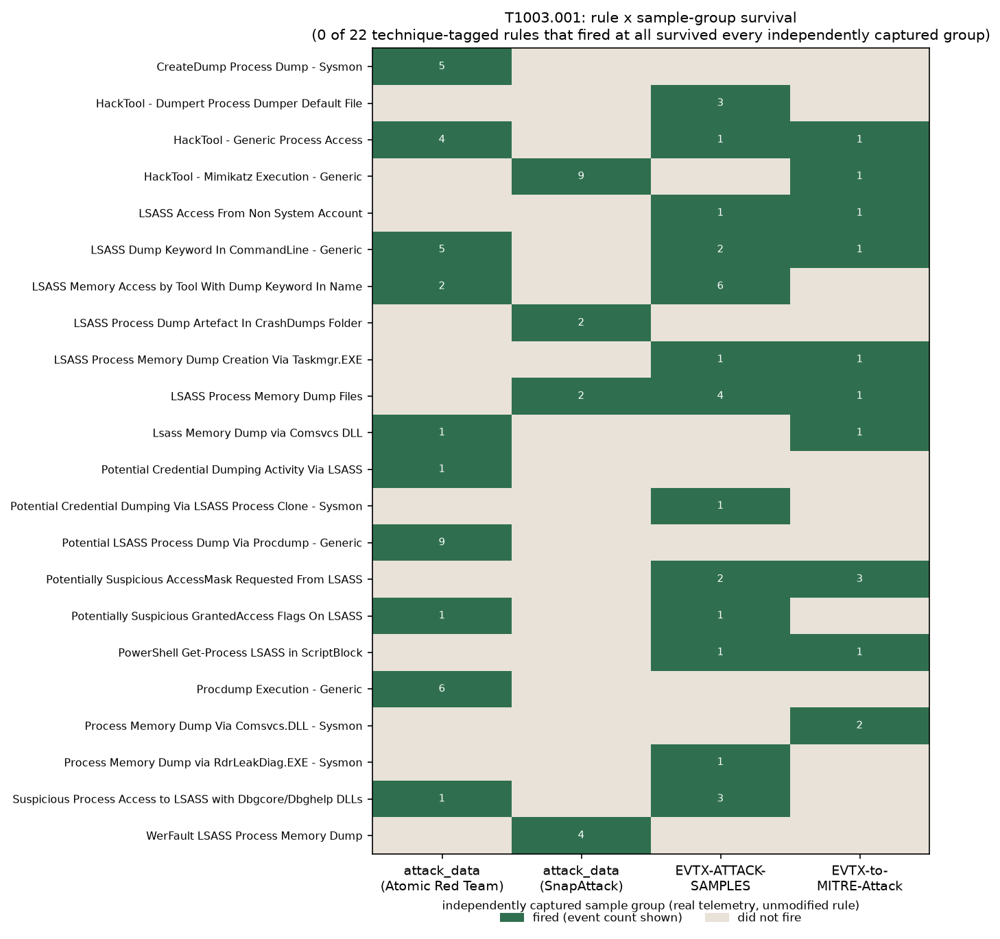

# Detection Brittleness

Detection rules get written against one observed intrusion, then get assumed
to catch the same attacker technique everywhere. Do they? This project takes
the same MITRE ATT&CK technique, executed by different tools in independently
captured, already-public telemetry, and runs the same unmodified Sigma rules
against each capture to see how many survive.

## Headline result

| Technique | Distinct rules tagged for it | Fired against >=1 sample | Fired against EVERY sample |
|---|---|---|---|
| [T1003.001](https://attack.mitre.org/techniques/T1003/001/) (OS Credential Dumping: LSASS Memory) | 71 | 22 | **0** |
| [T1059.001](https://attack.mitre.org/techniques/T1059/001/) (Command and Scripting Interpreter: PowerShell) | 208 | 21 | **1** |

Zero rules generalized across all four independently captured T1003.001
samples. That number alone would be easy to mistake for "these rules are all
badly written" or "Sigma doesn't work." Neither is true here. Every miss in
this project is traced to one of two causes, and the two require completely
different fixes:

- **Telemetry absent.** The rule's target event type was never recorded in
  that particular capture. No rule could have fired, no matter how it was
  written.
- **Logic too narrow.** The event type is present, but the rule's exact
  field or string match does not cover this tool's variant of the technique.

Across both techniques: **36 misses were telemetry-absent, 51 were
logic-too-narrow.** Full breakdown, per-rule, per-sample, with the exact
EventIDs checked, is in [`FINDINGS.md`](FINDINGS.md). (An earlier run of this
diagnosis reported 60/27; that was wrong because of a bug in how EventIDs
were read out of the two binary `.evtx` sample groups, fixed and written up
in full in FINDINGS.md's "Bug found during this project" section.)



## What this does NOT claim

- It does not claim these Sigma rules are bad. Several fired correctly on
  every sample they had eligible telemetry for.
- It does not claim 0% survival generalizes to all detection engineering.
  This is two techniques, four and three sample groups respectively, scored
  against one vendored ruleset. See "Scope and limits" below.
- It does not run, generate, or simulate any attack. Every event scored here
  is pre-existing, already-public, already-labelled telemetry sitting on
  disk under `_corpora/`. Nothing in this project executes offensive tooling.

## How it works

1. **Manifest.** [`manifest/technique_manifest.json`](manifest/technique_manifest.json)
   hand-maps each technique to specific files in three public corpora, with
   every inclusion and exclusion decision recorded and reasoned (filenames in
   these corpora are not always reliable; several were checked against actual
   event content and excluded when the content did not match the filename).
2. **Stage.** [`scripts/01_prepare_samples.py`](scripts/01_prepare_samples.py)
   copies the manifest's referenced files into `evidence/samples/` (regenerated,
   gitignored), wrapping `attack_data`'s raw one-event-per-line XML `.log` files
   in a single `<Events>` root so Zircolite's XML parser can read the whole
   file (its parser expects one well-formed document, not concatenated
   fragments; EVTX files need no such fix).
3. **Score.** [`scripts/02_run_zircolite.py`](scripts/02_run_zircolite.py) runs
   [Zircolite](https://github.com/wagga40/Zircolite) (vendored in the sibling
   `detection-as-code` project, referenced read-only, never modified) with its
   own documented default ruleset, `rules_windows_merged.json`, once per
   sample group, saving raw JSON output before any summarizing happens.
4. **Matrix.** [`scripts/03_build_matrix.py`](scripts/03_build_matrix.py) reads
   the raw output back and builds the rule x sample-group survival table.
5. **EVTX EventID inventory.** [`scripts/03b_extract_evtx_eventids.py`](scripts/03b_extract_evtx_eventids.py)
   asks Zircolite to decode each `.evtx` sample group's full, unfiltered event
   stream to JSON (`--no-event-filter --keepflat`), so the diagnosis step
   below has a real inventory of which EventIDs occur in binary EVTX data,
   not just the ones some rule already matched. This step exists because an
   earlier, simpler approach (reading EventIDs with a text regex, which works
   fine for `attack_data`'s XML) silently read nothing from the two `.evtx`
   groups; see FINDINGS.md's "Bug found during this project" section for the
   full story and the before/after numbers.
6. **Diagnose.** [`scripts/04_diagnose_misses.py`](scripts/04_diagnose_misses.py)
   checks, for every miss, whether the rule's target EventID(s) even occur in
   that sample group's raw data (from the XML text directly for `attack_data`,
   from step 5's inventory for EVTX groups), splitting misses into
   telemetry-absent vs logic-too-narrow rather than reporting one
   undifferentiated "miss" count. If a group's EventIDs cannot be determined
   at all, it reports `UNDETERMINED` rather than assuming telemetry-absent by
   default.
7. **Visualize.** [`scripts/05_render_matrix_heatmap.py`](scripts/05_render_matrix_heatmap.py)
   renders the matrix as a PNG. [`scripts/06_build_navigator_layer.py`](scripts/06_build_navigator_layer.py)
   emits an ATT&CK Navigator layer scoring each technique by its survival
   percentage.

Run in order:

```bash
python3 -m venv .venv && source .venv/bin/activate
pip install matplotlib numpy
python3 scripts/01_prepare_samples.py
source /home/kali/director/projects/detection-as-code/.venv/bin/activate  # has Zircolite's deps (orjson, lxml)
python3 scripts/02_run_zircolite.py
python3 scripts/03b_extract_evtx_eventids.py  # also needs Zircolite's venv
deactivate; source .venv/bin/activate
python3 scripts/03_build_matrix.py
python3 scripts/04_diagnose_misses.py
python3 scripts/05_render_matrix_heatmap.py
python3 scripts/06_build_navigator_layer.py
python3 -m pytest tests/ -q
```

Every script is idempotent: re-running from scratch reproduces the same
evidence files (Zircolite's rule matching is deterministic against static
input).

## Why two corpora formats needed different handling

`attack_data`'s `.log` files are not JSON despite the extension: they are raw
Windows Event Log XML, one `<Event>...</Event>` element per line, with no
enclosing root element. Zircolite's XML mode (`-x`) uses `lxml.etree.iterparse`,
which requires a single well-formed document; fed the raw file, it silently
stopped after the first `<Event>` and reported 1 event processed out of 24 (or
514, or however many lines the file had). Wrapping the file's events in one
`<Events>...</Events>` root, without touching a single field inside any
event, fixed this and let Zircolite process every event. This is recorded as
a preprocessing step in the manifest and scripts, not folded silently into
the results.

`EVTX-ATTACK-SAMPLES` and `EVTX-to-MITRE-Attack` are native `.evtx` binary
event log files, which Zircolite reads directly with no preprocessing for
staging and scoring. That same binary format did need separate handling one
step later, in miss diagnosis: see FINDINGS.md's "Bug found during this
project" section for the EVTX EventID extraction defect and its fix.

## Manifest audit

The technique-to-sample mapping in `manifest/technique_manifest.json` is
hand-curated and disclosed as such. Filenames in these corpora are sometimes
wrong: `sysmon_10_1_memdump_comsvcs_minidump.evtx` in EVTX-ATTACK-SAMPLES is
named as an LSASS dump but its own `TargetImage` field shows it dumps
`notepad.exe`; `CA_teamviewer-dumper_sysmon_10.evtx` targets `TeamViewer.exe`,
not `lsass.exe`. Both were excluded after checking event content directly
(not filename pattern-matching), and the exclusion with its reason is in the
manifest. 16 files total across both EVTX corpora were excluded from the
T1003.001 sample set after content inspection contradicted either the
filename or the folder's technique label (some files in the
"T1003-Credential dumping" folder are actually SAM or NTDS/DCSync
sub-techniques, not LSASS memory).

## Licences

| Corpus | Licence | Format |
|---|---|---|
| [`attack_data`](https://github.com/splunk/attack_data) | Apache License, Version 2.0 | `.log` (raw XML, one event per line) + `.yml` run metadata |
| [`EVTX-ATTACK-SAMPLES`](https://github.com/sbousseaden/EVTX-ATTACK-SAMPLES) | GNU General Public License v3 | `.evtx`, labelled by tactic folder + self-describing filename |
| [`EVTX-to-MITRE-Attack`](https://github.com/mdecrevoisier/EVTX-to-MITRE-Attack) | Creative Commons CC0 1.0 Universal | `.evtx`, labelled by tactic AND technique folder |
| [`security_content`](https://github.com/splunk/security_content) | Apache License, Version 2.0 | 2,155 Splunk SPL detection YAMLs (not Sigma, not directly Zircolite-evaluable; used only as the corpus-overlap reference, not scored) |

Sigma detection rules (via Zircolite's vendored ruleset) are SigmaHQ content
under the **Detection Rule License 1.1**, which requires per-rule author
attribution wherever matches are displayed. Every rule named in
`FINDINGS.md` and `evidence/03_matrix_summary.txt` carries its title as
published by SigmaHQ; author fields are preserved in the raw JSON under
`evidence/zircolite_raw/`.

Zircolite itself is vendored (not modified) at
`../detection-as-code/vendor/Zircolite`, LGPL-licensed.

## Corpus overlap: the 203/342 figure

`_corpora/attack_data/datasets/attack_techniques/` has 342 technique folders;
203 of them contain 2 or more independently authored/dated dataset
subfolders, meaning the same technique was captured by different
authors/tools more than once. This was recomputed directly from the
directory tree for this project (not assumed from the task brief) and
matched: see `tests/test_findings.py::test_203_of_342_attack_data_technique_folders_have_multiple_sources`.

## GUI evidence

Per project policy (see `memory/evidence-must-show-real-tools.md` in the
parent director repo), a project's evidence should show the tool a
practitioner would actually have open, not just terminal output.

**What was captured:**

- `evidence/gui/matrix_heatmap_T1003001.png` and `matrix_heatmap_T1059001.png`:
  real matplotlib renders generated directly from `evidence/03_matrix.json`
  by `scripts/05_render_matrix_heatmap.py`. Not hand-drawn; every cell and
  count in the image is read straight from the saved evidence file.
- `evidence/gui/survival-navigator-layer.json`: a real ATT&CK Navigator layer
  file scoring T1003.001 at 0% and T1059.001 at 4.8% survival, generated by
  `scripts/06_build_navigator_layer.py` from the same evidence file.
- `evidence/gui/navigator-layer-loaded.png` and
  `navigator-t1003001-t1059001-visible.png`: the layer above loaded into the
  real, live MITRE ATT&CK Navigator web app
  (`https://mitre-attack.github.io/attack-navigator/`) in an isolated
  Chromium profile on the live X display, screenshotted directly from that
  window (never the operator's own browser profile or session). The tab
  title reads "Detection rule survival across independent tool executions"
  (the layer's own `name` field, confirming the real app parsed and loaded
  it, not a mockup), and the matrix shows "T1003 OS Credential Dumping
  (1/6)" and "T1059 Command and Scripting Interpreter (1/6)", the
  fired-at-least-once counts from this project's own scoring, rendered by
  Navigator's own UI.

**What was attempted and did not complete, disclosed rather than faked:**

- **Splunk Web.** A local Splunk Enterprise instance is running and licensed
  at `http://localhost:8000`. Its `admin` password is intentionally not
  stored anywhere accessible to this project (a prior incident hardcoded it
  in five files across three repos, one of them public, and it was
  deliberately removed and not replaced; see
  `memory/splunk-lab-local-credential.md` in the parent director repo). This
  project's evidence is scored entirely through Zircolite/SQLite, not
  Splunk, and does not require Splunk at all; loading it into Splunk was an
  optional presentation enhancement, not something this project's results
  depend on. Rather than guess, brute-force, or otherwise work around that
  password boundary, this is reported as a real, disclosed blocker: no
  Splunk Web screenshot was produced, and none was faked.
- **ATT&CK Navigator's sub-technique drill-down.** The Navigator screenshots
  captured show the parent techniques (T1003, T1059) with their
  fired-at-least-once sub-technique counts, since that is what Navigator's
  default collapsed matrix view displays. Expanding to show the T1003.001 /
  T1059.001 sub-technique row's own individual color (as opposed to the
  parent row's aggregate count) requires a per-cell expand interaction that
  did not respond reliably to synthetic clicks within this project's time
  budget for a single sub-task; the automatic `#layerURL=` hash-based load
  also failed with an in-app CORS-related error before the working path
  (the in-app "Load from URL" field plus its own network-permission prompt)
  was found. The layer JSON itself is real, valid, and was confirmed loaded
  correctly by the real app (tab title, technique counts both match the
  layer's own data). A human operator can see the sub-technique-level color
  in under 30 seconds by clicking the small expand indicator on the T1003 or
  T1059 row in the live Navigator.

## Scope and limits

- **Two techniques, not five.** T1548 and T1078 were both considered
  (flagged in the build brief as high-overlap candidates) and dropped after
  inspection: T1548's `attack_data` subfolders are almost entirely Linux
  GTFOBins tool names, not comparable to a Windows Sysmon/Sigma evaluation;
  T1078's subfolders are dominated by cloud-control-plane API logs that the
  Windows-oriented ruleset used here cannot meaningfully score. Depth on two
  techniques, done honestly, was chosen over shallow coverage of five. See
  `FINDINGS.md` for the full reasoning.
- **One ruleset.** All scoring uses Zircolite's vendored
  `rules_windows_merged.json`. A different Sigma ruleset build, or a
  different Zircolite pipeline configuration, could show different
  survival numbers. That is expected and is why the exact ruleset path is
  recorded in every script and cited in `FINDINGS.md`.
- **Secondary (synthetic field-mutation) approach not run.** No rule
  survived all four real T1003.001 samples to begin with, so there was no
  "survives-real-data" rule to layer synthetic mutation on top of for that
  technique; T1059.001's single survivor was judged low information value
  to mutate given the effort budget. See `FINDINGS.md` for the full
  reasoning.
