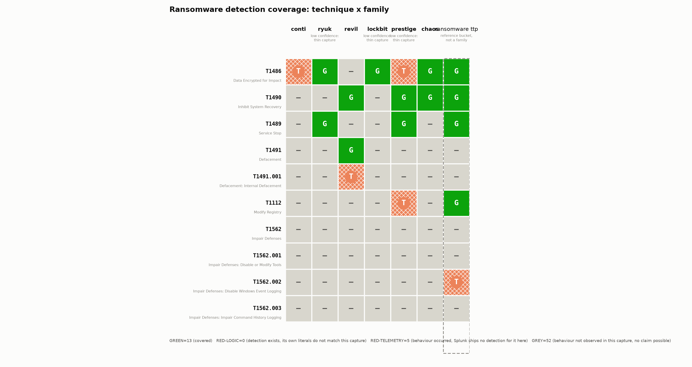

# Ransomware Detection Coverage Map

Ransomware families use different tooling but converge on a handful of
behaviours: encrypt files, delete shadow copies, stop services, change the
desktop wallpaper, disable defences. A detection manager needs to know
which of those behaviours are actually covered, for which families, and
where the real holes are. This project builds that coverage map from
already-captured, already-public log data and Splunk's own published
detection content, no malware sample is downloaded or run anywhere in
this project.

## Correction (2026-08-28): the original headline claim failed a live test

This project originally claimed a real Splunk detection-logic gap: two
cells, `lockbit_ransomware|T1486` and `chaos_ransomware|T1486`, scored
RED-LOGIC because a candidate detection's own SPL,
`file_name IN ("*\.txt","*\.html","*\.hta")`, read strictly, requires a
literal backslash before the extension, which no real ransom-note filename
has. That reading was flagged in the original FINDINGS.md section 6 as an
open question, resolvable only by testing against a live Splunk instance.
It has since been tested directly against Splunk Enterprise 10.4.2. Splunk
treats the backslash permissively: `"*\.txt"` matches a plain ".txt"
filename exactly like `"*.txt"` does. **The strict reading was wrong.** Both
cells are GREEN, not RED-LOGIC. Full test evidence in
[`evidence/07_spl_backslash_resolved.txt`](evidence/07_spl_backslash_resolved.txt)
and the full account, including a near-miss where a broken test harness
almost got read as confirming the wrong answer, in
[`FINDINGS.md`](FINDINGS.md) section 13.

With zero RED-LOGIC cells, the original falsifiable claim ("Splunk's
ransomware detection content does not uniformly cover the same core
technique set across families") is **not supported** and the claim fails.
This is now a **capture-completeness story, not a detection-gap story**:
everywhere a behaviour was captured, at least one Splunk detection's own
logic covered it. The reason most of the map is grey is that the sample
data does not contain most of the ransomware behaviours this project set
out to score, not that Splunk failed to detect them. The rest of this
README is corrected to reflect that conclusion; the sections below carry
both the original and corrected numbers so the change is traceable.

## The finding that shapes the whole project

Grepping every family's raw capture for the exact terms
`vssadmin|wbadmin|bcdedit|shadowcopy` (the standard command-line tools and
strings behind MITRE ATT&CK [T1490](https://attack.mitre.org/techniques/T1490/),
Inhibit System Recovery, the technique behind shadow-copy deletion) gives:

| Family | Files with T1490 evidence |
|---|---|
| conti | 0 |
| ryuk | 0 |
| lockbit_ransomware | 0 |
| revil | 1 |
| prestige_ransomware | 1 |
| chaos_ransomware | 2 |
| ransomware_ttp | 5 |

Shadow-copy deletion is the single most famous ransomware behaviour there
is, and it is **absent from the Conti, Ryuk, and LockBit captures
entirely.** A naive coverage map would paint a red cell for those three and
imply "our detections miss shadow-copy deletion for LockBit," when the
truth is that the behaviour was never captured in the first place, no
claim about detecting it is possible from this evidence. **A map that
cannot tell "we missed it" from "it never happened" is worse than no map.**
Preventing that confusion is this project's central engineering problem,
and it is visible directly in the chart below (those three cells are grey,
not red), not buried in a caveat. Full trace, including a real terminal
screenshot of the grep, in [`FINDINGS.md`](FINDINGS.md) section 1.

## The coverage map



Cell counts (from [`matrix/coverage_matrix.json`](matrix/coverage_matrix.json),
reproduced by `scripts/04_build_matrix.py`):

| State | Count | Meaning |
|---|---|---|
| GREEN | 13 | Behaviour present in the capture AND a candidate detection's own logic matches it |
| RED-LOGIC | 0 | Behaviour present; a detection exists for this family+technique, but its own terms never occur in this capture, a real gap |
| RED-TELEMETRY | 5 | Behaviour present; Splunk ships no detection tagged to this technique for this family at all, a tooling gap |
| GREY | 52 | Behaviour not observed in this capture at all, no claim is possible, and none is made |

(Original, now-corrected counts: 11 GREEN, 2 RED-LOGIC, 5 RED-TELEMETRY, 52
GREY. See the correction section above and `FINDINGS.md` section 13.)

## Cell taxonomy (why four states, not two)

A bare red/green matrix cannot distinguish a real detection gap from a
capture that never exercised a behaviour at all. This project scores every
cell as exactly one of:

- **GREEN**, the behaviour is present in the capture, and at least one
  detection tagged to this technique and this family has its own literal
  match terms (a process name, command-line fragment, or registry path)
  physically present in that same capture.
- **RED-LOGIC**, the behaviour is present, a detection exists that claims
  to cover it for this family, but that detection's own terms do not occur
  anywhere in the capture. The detection's specific variant does not match
  what this family's tooling actually did.
- **RED-TELEMETRY**, the behaviour is present, but Splunk's
  `security_content` ships no detection tagged to this exact
  technique+family pair at all. Nothing could ever have fired here,
  regardless of how well any single rule was written.
- **GREY**, the behaviour was not observed in this family's capture. No
  claim is possible, and the taxonomy makes that explicit rather than
  defaulting to red or green. **GREY is not a failure state; it is the
  honest answer**, and distinguishing it from RED is the entire point of
  this project.

## Does the falsifiable claim hold?

Stated claim: Splunk's ransomware detection content, despite naming
specific families in its metadata, does not uniformly cover the same core
technique set across families. This requires at least one real RED-LOGIC
cell. **It does not hold: RED-LOGIC is zero.** The two candidate cells
(`lockbit_ransomware|T1486`, `chaos_ransomware|T1486`) were reported
RED-LOGIC under a strict reading of one detection's SPL that this project
flagged as unresolved without a live Splunk instance (see the original
`FINDINGS.md` section 6). That instance has since been used, once, to test
exactly this question, and the strict reading was wrong: Splunk's
search-time wildcard matcher treats the backslash permissively, so both
detections' own logic does match what these two families' captures
actually contain. Both cells are GREEN.

**The honest conclusion is "this is a capture-completeness story, not a
detection-gap story"** for the technique set tested here: everywhere a
targeted behaviour was present in a capture, at least one Splunk detection's
own logic matched it (13 of 18 non-grey cells GREEN; the remaining 5 are
RED-TELEMETRY, a Splunk tooling gap of "no detection tagged to this
family+technique at all," never a written-but-wrong rule). The dominant
result is the 52 GREY cells: most of the candidate technique/family pairs
were never exercised in the sample captures at all, so no claim about
Splunk's detection quality is possible for them either way. Full account in
[`FINDINGS.md`](FINDINGS.md) section 13.

## Why this project is not redundant with anything Splunk already publishes

- Splunk ships 397+ ransomware-related endpoint detections and 23+
  family-specific analytic stories in `security_content`, but has never
  published a ransomware coverage matrix of its own.
- It DID build exactly this artifact shape for other malware:
  `security_content/deprecated/mitre-map/` holds Navigator-format
  per-family coverage JSON for Qakbot, Remcos, AgentTesla, Azorult,
  Trickbot, and seven RAT/stealer families. That directory is marked
  **deprecated**, and no ransomware family was ever included in it --
  verified directly (see [`FINDINGS.md`](FINDINGS.md) section 8), not
  assumed.
- The sibling project `detection-brittleness` holds one technique fixed
  and varies the tool used to execute it. This project holds a *set* of
  behaviours fixed and varies the family, which surfaces a different shape
  of gap: "we detect T1486 everywhere, T1490 almost nowhere it happened."

## Data used, and its real limits

Seven datasets under `attack_data/datasets/malware/` (Apache-2.0), read
only, never modified: `conti`, `ryuk`, `revil`, `lockbit_ransomware`,
`prestige_ransomware`, `chaos_ransomware`, `ransomware_ttp`. Detection
content from `security_content` (also Apache-2.0), read only.

**These datasets are not comparable in size or richness**, and the map says
so directly rather than only in prose:

| Family | Log lines | Files | Sourcetypes | Confidence |
|---|---|---|---|---|
| conti | 115,348 | 7 | Sysmon, Security, PowerShell | standard |
| revil | 92,384 | 5 | Sysmon | standard |
| ransomware_ttp (reference bucket, not a family) | 53,989 | 9 | Sysmon, others | reference |
| chaos_ransomware | 48,400 | 2 | Sysmon | standard |
| prestige_ransomware | 14,894 | 1 | Sysmon | **low** |
| lockbit_ransomware | 10,920 | 1 | Sysmon | **low** |
| ryuk | 6,199 | 1 | Sysmon | **low** |

`ryuk`, `lockbit_ransomware`, and `prestige_ransomware` are each a single
Sysmon-only file. A red cell in one of these three columns is materially
weaker evidence of a real gap than the same red cell in `conti` or `revil`,
and [`matrix/coverage_matrix.png`](matrix/coverage_matrix.png) marks those
three columns "(low confidence: thin capture)" directly under the column
header, not only here.

`ransomware_ttp` is a generic ransomware-*techniques* capture bucket
(three unrelated sub-captures: `data1`, `data2`, `ssa_data1`), not a single
named family. It is used here as a labelled **reference column**, visually
boxed with a dashed border in the chart, and is never presented as a
seventh family.

## How the pipeline works

Five numbered, idempotent scripts, run in order:

1. [`01_build_capture_evidence.py`](scripts/01_build_capture_evidence.py) --
   for every family x technique cell, greps the family's raw `.log` files
   for the technique's hand-reasoned patterns (see
   [`manifest/technique_manifest.json`](manifest/technique_manifest.json),
   which documents every pattern's reasoning and every rejected pattern
   that turned out to be a false positive). Writes raw, uncounted grep
   output to `evidence/01_capture_grep/*.txt` before any number is
   computed, so every count can be traced back to real matched lines.
2. [`02_index_detections.py`](scripts/02_index_detections.py), parses
   every `security_content/detections/endpoint/*.yml` and indexes each by
   its `mitre_attack_id` and `analytic_story` tags.
3. [`03_score_detection_logic.py`](scripts/03_score_detection_logic.py) --
   for every candidate detection tagged to a family's story and a
   technique, extracts the detection's own literal SPL match terms and
   greps them against the same raw captures stage 1 used, to tell GREEN
   from RED-LOGIC instead of assuming a tagged detection would fire. Three
   real extraction bugs were found and fixed while building this stage
   (escaped quotes, escaped backslashes, and an SPL wildcard character
   being treated as literal), see [`FINDINGS.md`](FINDINGS.md) section 5.
4. [`04_build_matrix.py`](scripts/04_build_matrix.py), combines stages 1
   and 3 into the final four-state matrix
   (`matrix/coverage_matrix.json`), deterministically: a fixed lookup per
   cell, no order-dependent aggregation. Verified to rebuild
   byte-identical twice (`tests/test_matrix_determinism.py`), after the
   sibling `detection-brittleness` project's matrix builder was found to
   assign rather than sum per-variant counts and produce different results
   between runs.
5. [`05_render_matrix_chart.py`](scripts/05_render_matrix_chart.py) --
   renders the matrix as a real matplotlib chart from the JSON file, never
   a hand-authored image. Every cell carries color, a hatch pattern, AND a
   text glyph, so the four states are distinguishable even without color
   (colorblind-safe by construction, not by inspection).
6. [`06_build_navigator_layers.py`](scripts/06_build_navigator_layers.py)
  , emits one MITRE ATT&CK Navigator layer JSON per real family (not the
   reference bucket), matching the exact schema Splunk's own deprecated
   `mitre-map` coverage files use, under `matrix/navigator_layers/`.

## Lessons carried over from `detection-brittleness`

Per instruction, this project reused that project's approach rather than
rebuilding it, and specifically avoided its two hard-won failure modes:

1. It once classified telemetry as absent by reading EventIDs as text out
   of **binary** `.evtx` files, extracted nothing, and every miss silently
   defaulted to "telemetry absent" even when the true cause was different.
   This project's stage 3 does the equivalent check (never assume "no
   result" means "gap"): any detection whose literals cannot be extracted
   is reported as `UNDETERMINED-UNPARSEABLE-SEARCH`, never silently folded
   into RED-LOGIC or GREEN, and in practice, every extraction bug found
   here (see `FINDINGS.md` section 5) was caught precisely because
   UNDETERMINED cells were inspected by hand before being resolved, rather
   than trusted on first pass.
2. Its matrix builder assigned rather than summed per-variant counts, so
   results changed between runs. This project's `04_build_matrix.py` is a
   pure, order-independent lookup per cell and is verified deterministic
   by rebuilding twice and diffing (`tests/test_matrix_determinism.py`).

## What this project does not claim

- It does not claim these are the only ransomware behaviours worth
  detecting, or that ten technique rows exhaust MITRE's coverage of
  ransomware. They are the candidate rows named in this project's brief,
  each verified individually at attack.mitre.org (see `FINDINGS.md`
  section 3).
- It does not claim Splunk's detections are badly written. Every candidate
  detection that was tested fired correctly (13 GREEN cells) against real,
  independently captured telemetry it was never tuned against by this
  project. There are zero RED-LOGIC cells: no case in this dataset where a
  detection existed, targeted the right family and technique, and still
  missed what was actually there.
- It does not run, generate, or simulate any attack, and does not download
  or execute any ransomware binary or encryptor. Every event scored here is
  pre-existing, already-public, already-labelled telemetry under
  `_corpora/`.
- Stage 3's "does this detection's logic match" verdict is a literal-string
  check against raw capture text, a well-reasoned proxy, not a live SPL
  execution, for every cell except the one interpretive question that was
  live-tested (how Splunk treats a backslash-dot that is not a defined SPL
  escape, see `FINDINGS.md` section 13). That one question was tested
  directly against a running Splunk Enterprise 10.4.2 instance, once, for
  this specific ambiguity; the rest of the matrix still rests on the
  literal-extraction proxy, not on live SPL execution.

## What was capped, per the project's effort budget

- A full live Splunk instance was not stood up to execute every SPL search
  in the matrix directly; stage 3's literal-extraction proxy was used for
  all cells (see above). One narrow, load-bearing ambiguity in that proxy
  (the backslash-dot question) was resolved with a single, targeted live
  Splunk test rather than reproducing the entire pipeline against a running
  instance, which was judged the better use of the remaining time budget.
- A live MITRE ATT&CK Navigator capture (loading `matrix/navigator_layers/`
  into the public Navigator UI and screenshotting it) was intentionally
  **not** done. The brief marked this optional ("if you do"), and the
  layer JSON itself is schema-verified against Splunk's own deprecated
  format instead, which was judged the better use of the remaining time
  budget than a browser-driven capture of a page this project does not
  otherwise depend on.
- `ryuk`, `lockbit_ransomware`, and `prestige_ransomware` were kept as
  columns despite being thin, single-file, Sysmon-only captures, rather
  than dropped, because their capture is still sufficient to prove
  presence/absence for the rows that matter (T1486, T1489, T1490), but
  every output marks them low-confidence rather than presenting them at
  the same evidentiary weight as `conti` or `revil`.

## Repository layout

```
ransomware-coverage-map/
  README.md                    this file
  FINDINGS.md                  every number traced to a named evidence file
  manifest/technique_manifest.json   every row/column decision, reasoned
  scripts/                     01-06, numbered, idempotent
  evidence/01_capture_grep/    raw grep output, one file per family x technique
  evidence/01_capture_evidence_summary.json
  evidence/02_detection_index.json
  evidence/03_detection_logic_scores.json
  evidence/gui/                real terminal captures (termcap.sh, not termshot.py)
  matrix/coverage_matrix.json  the generated matrix, source of truth
  matrix/coverage_matrix.png   the rendered chart
  matrix/navigator_layers/     one ATT&CK Navigator layer JSON per family
  tests/                       pytest, SKIP (not FAIL) when corpus is absent
```

## Running it

```
python3 -m venv .venv && .venv/bin/pip install matplotlib pyyaml pytest
.venv/bin/python3 scripts/01_build_capture_evidence.py
.venv/bin/python3 scripts/02_index_detections.py
.venv/bin/python3 scripts/03_score_detection_logic.py
.venv/bin/python3 scripts/04_build_matrix.py
.venv/bin/python3 scripts/05_render_matrix_chart.py
.venv/bin/python3 scripts/06_build_navigator_layers.py
.venv/bin/python3 -m pytest tests/ -v
```
